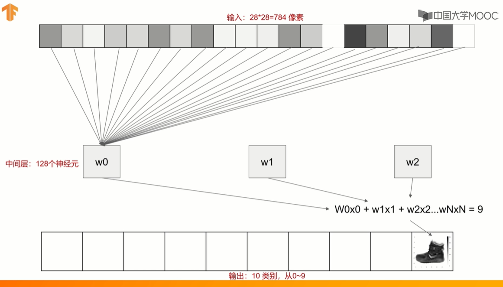
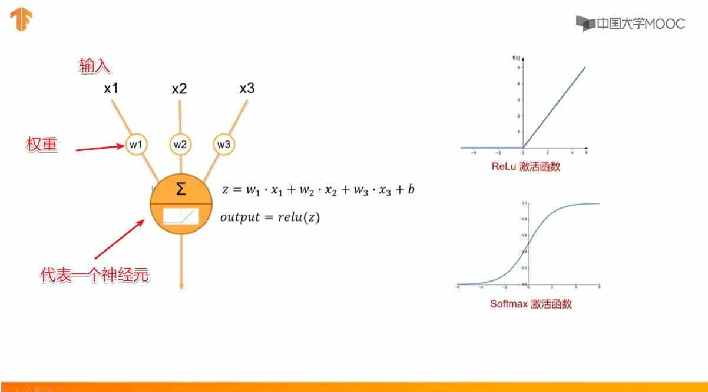

```python
import tensorflow as tf
from tensorflow import keras

# load image datas used for trainning
fashion_mnist = keras.datasets.fashion_mnist
(train_images, train_labels), (test_images, test_labels) = fashion_mnist.load_data()
```


```python
model = keras.Sequential()
#输入层:输入数据的 shape 28x28 尺寸的图形
model.add(keras.layers.Flatten(input_shape = (28, 28)))
#中间层:128个神经元, 并指定 激活函数为 relu()
model.add(keras.layers.Dense(128, activation = tf.nn.relu))
#输出层:10个类别(神经元), 并指定激活函数为 softmax()
model.add(keras.layers.Dense(10, activation = tf.nn.softmax))
```


```python
# 模型的样子
# 28 * 28 = 784pixels
# 784pixels * 128 neurons = 100352
# (784 + 1bias) * 128 = 100480
# (128 + 1) * 10 = 1290
model.summary()
```

    Model: "sequential_1"
    _________________________________________________________________
    Layer (type)                 Output Shape              Param #
    =================================================================
    flatten_1 (Flatten)          (None, 784)               0
    _________________________________________________________________
    dense (Dense)                (None, 128)               100480
    _________________________________________________________________
    dense_1 (Dense)              (None, 10)                1290
    =================================================================
    Total params: 101,770
    Trainable params: 101,770
    Non-trainable params: 0
    _________________________________________________________________




